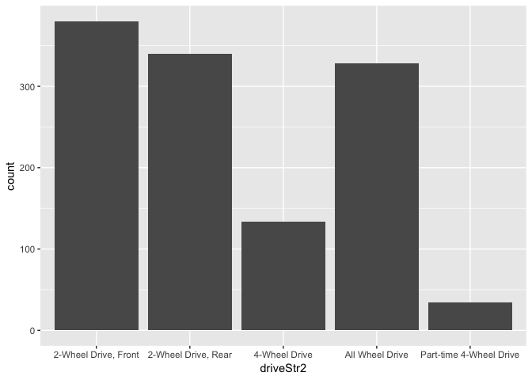
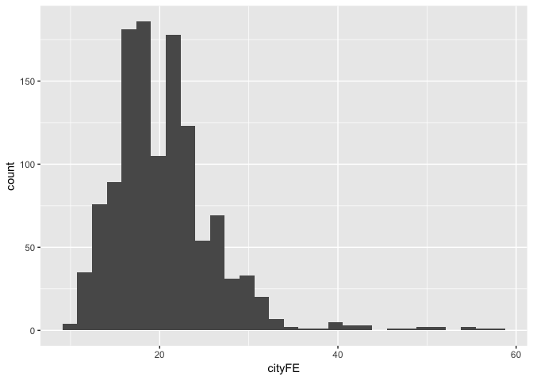

Lab-02
================
Christopher Prener, Ph.D.
(September 12, 2018)

## Introduction

This notebook replicates the code needed to solve

## Dependencies

This notebook relies on the `datasets` package for data as well as the
`stats` and `base` packages. These are automatically loaded by RStudio
and no `library()` function calls are needed here.

In addition, we need the `ggplot2` package for plotting, the `janitor`
package for tables, the `skimr` package for descriptive statistics, and
the `testDriveR` package for data:

``` r
# tidyverse packages
library(ggplot2)   # plotting data

# other packages
library(janitor)     # frequency tables
library(skimr)       # descriptive statistics
library(testDriveR)  # data
```

## Load Data

This notebook requires data from `auto17`:

``` r
cars <- auto17
```

## Part 1

An additional replication file is available in the replication repo
showing the work done by hand.

## Part 2

### Question 5

For the varaible `driveStr2`, the starting point is to determine what
level of measurement it represents. Quickly we, can use `summary()` to
determine this:

``` r
summary(cars$driveStr2d)
```

    ## Length  Class   Mode 
    ##      0   NULL   NULL

It is character, which is *usually* an indication that it is a
categorical or ordinal variable. Perhaps we can learn more from a quick
frequency table:

``` r
table(cars$driveStr2)
```

    ## 
    ##    2-Wheel Drive, Front     2-Wheel Drive, Rear           4-Wheel Drive 
    ##                     380                     340                     134 
    ##         All Wheel Drive Part-time 4-Wheel Drive 
    ##                     328                      34

Now we can see that there are five possible values representing whether
the car is two wheel drive, four wheel drive, or all wheel drive. This
means it is a categorical variable.

#### Plot

The most appropriate plot for a categorical variable like `driveStr2` is
a bar plot.

``` r
ggplot(data = cars) +
  geom_bar(mapping = aes(x = driveStr2))
```

<!-- -->

From the plot, we can see that two wheel drive cars are far and away the
most common types of vehicles, with a pretty even split between those
with front wheel drive and those with rear wheel drive. The next most
common type of drive system is all wheel drive, followed by four wheel
drive.

#### Frequency Table

We can create a slightly nicer looking frequency table using the
`janitor` package.

``` r
tabyl(cars, driveStr2)
```

    ##                driveStr2   n    percent
    ##     2-Wheel Drive, Front 380 0.31250000
    ##      2-Wheel Drive, Rear 340 0.27960526
    ##            4-Wheel Drive 134 0.11019737
    ##          All Wheel Drive 328 0.26973684
    ##  Part-time 4-Wheel Drive  34 0.02796053

The frequency table and the plot give us largely the same amount of
information, though we can more easily see specific count and percent
values using the table.

#### Mode

Based on both the plot and the table, we can see that the mode is two
wheel drive vehicles that are front wheel drive, with an \(n\) of
\(380\). These represent \(31.25\)% of the observations in these data.

### Question 6

For the varaible `cityFE`, the starting point is to determine what level
of measurement it represents. Quickly we, can use `summary()` to
determine this:

``` r
summary(cars$cityFE)
```

    ##    Min. 1st Qu.  Median    Mean 3rd Qu.    Max. 
    ##   10.00   17.00   20.00   20.59   23.00   58.00

The output here indicates that these are continuous data.

#### Plot

One appropriate plot for a continuous variable like `cityFE` is a
histogram.

``` r
ggplot(data = cars) +
  geom_histogram(mapping = aes(x = cityFE))
```

    ## `stat_bin()` using `bins = 30`. Pick better value with `binwidth`.

<!-- -->

The plot gives us the sense that the most common fuel efficienies are in
the high teens and low twenties. Cars with city fuel economy greater
than 30 miles per gallon are not common, though there are a few with
fuel efficiencies as high as the high 50s.

#### Median

We can get the median with a stand alone function:

``` r
median(cars$cityFE)
```

    ## [1] 20

The median value of the `cityFE` distribution is \(20\).

#### Mean

We can get the mean with a stand alone function:

``` r
mean(cars$cityFE)
```

    ## [1] 20.59293

The median value of the `cityFE` distribution is \(20.593\).

#### Standard Deviation

We can get the standard deviation with a stand alone function:

``` r
sd(cars$cityFE)
```

    ## [1] 5.867922

The standard deviation value of the `cityFE` distribution is \(5.868\).
This means that the majority of cars have a city fuel economy between
\(14.725\) and \(26.461\) miles per gallon (the mean plus or minus the
standard deviation).

#### Range

We can get the range with a combination of the maximum and minimum
values:

``` r
max(cars$cityFE)-min(cars$cityFE)
```

    ## [1] 48

The range of the `cityFE` distribution is \(48\).

#### Inter-Quartile Range

We can get the IQR with a stand alone function:

``` r
IQR(cars$cityFE)
```

    ## [1] 6

The IQR of the `cityFE` distribution is \(6\). When combined with the
median, this suggests that the bulk of the observations (\(50\)%) lie
within a few miles per gallon of \(20\).

### Question 7

We can also use the `skimr` package to create a full output of
descriptive statistics:

``` r
skim(cars)
```

    ## Skim summary statistics
    ##  n obs: 1216 
    ##  n variables: 21 
    ## 
    ## ── Variable type:character ───────────────────────────────────────────────────────────────────────────────────────────────
    ##     variable missing complete    n min max empty n_unique
    ##       airAsp       0     1216 1216  12  25     0        4
    ##  carClassStr       0     1216 1216  10  36     0       22
    ##      carLine       0     1216 1216   2  34     0      786
    ##     driveStr       0     1216 1216   1   1     0        5
    ##    driveStr2       0     1216 1216  13  23     0        5
    ##      fuelStr       0     1216 1216   1   3     0        5
    ##     fuelStr2       0     1216 1216  36  42     0        5
    ##   guzzlerStr       0     1216 1216   0   1  1146        2
    ##          mfr       0     1216 1216   3  30     0       25
    ##  mfrDivision       0     1216 1216   3  13     0       42
    ##     transStr       0     1216 1216   8  11     0       25
    ##    transStr2       0     1216 1216   1   3     0        7
    ## 
    ## ── Variable type:integer ─────────────────────────────────────────────────────────────────────────────────────────────────
    ##  variable missing complete    n     mean     sd    p0      p25     p50
    ##  carClass       0     1216 1216    12.55  11.99     1     4        6  
    ##    cityFE       0     1216 1216    20.59   5.87    10    17       20  
    ##    combFE       0     1216 1216    23.27   5.84    11    19       23  
    ##       cyl       0     1216 1216     5.59   1.9      3     4        6  
    ##  fuelCost       0     1216 1216  1791.45 470.15   650  1450     1750  
    ##     gears       0     1216 1216     6.62   1.56     1     6        6  
    ##     hwyFE       0     1216 1216    27.83   6.01    11    24       27  
    ##        id       0     1216 1216 20444.66 558.02 19324 19976.25 20481.5
    ##       p75  p100     hist
    ##     30       33 ▇▂▁▁▁▁▁▅
    ##     23       58 ▅▇▃▁▁▁▁▁
    ##     26       58 ▂▇▇▂▁▁▁▁
    ##      6       12 ▇▁▆▁▃▁▁▁
    ##   2050     3800 ▁▅▇▇▂▁▁▁
    ##      8       10 ▁▁▁▁▇▃▅▁
    ##     31       59 ▁▅▇▅▂▁▁▁
    ##  20942.25 21485 ▃▆▆▆▇▆▇▃
    ## 
    ## ── Variable type:numeric ─────────────────────────────────────────────────────────────────────────────────────────────────
    ##  variable missing complete    n mean   sd  p0 p25 p50 p75 p100     hist
    ##     displ       0     1216 1216 3.11 1.36 0.9   2   3 3.6  8.4 ▃▇▇▂▂▂▁▁
