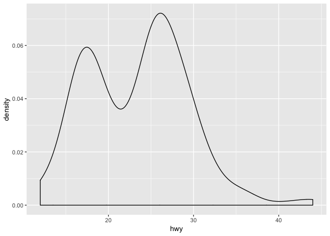

Lecture 03 Example Code
================
Christopher Prener, Ph.D.
(September 10, 2018)

## Introduction

This notebook illustrates functions for calculating descriptive
statistics.

## Dependencies

This notebook requires the `ggplot2` package as well as the `janitor`
and `skimr` packages.

``` r
# tidyverse packages
library(ggplot2) # for the mpg data

# other packages
library(skimr)   # descriptive statistics
```

We’ll also use `base` and `stats`, but they are already loaded\!

## Load Data

This notebook requires data from the `ggplot2` package:

``` r
auto <- mpg
```

## Illustrate Density Plots

First, we’ll cover the new `geom` from `ggplot2` - `geom_density()`.
This works the same way as other continuous geoms:

``` r
ggplot(data = auto) + 
  geom_density(mapping = aes(x = hwy))
```

<!-- -->

Remember to interpret this as density and not as the raw frequency of
observations\!

## Individual Descriptive Statistics

We can calculate mean, median, and standard deviation separately:

``` r
median(auto$hwy)
```

    ## [1] 24

``` r
mean(auto$hwy)
```

    ## [1] 23.44017

``` r
sd(auto$hwy)
```

    ## [1] 5.954643

Note how this is specified (`df$var`) and how looks in terms of output -
they aren’t labeled. The output follows the sequence of the inputs -
median, then mean, than mode. The average highway fuel efficiency is
23.440 miles per gallon and the typical deviation from this mean is plus
or minus 5.955 miles per gallon - the bulk of observations lie between
17.4 and 29.4. Remember that, when there is missing data, all of these
functions need the `na.rm = TRUE` optional argument\!

The range can be found by subtracting the min value from the max:

``` r
max(auto$hwy)-min(auto$hwy)
```

    ## [1] 32

The `range()` function will give you those max and min values rather
than the difference:

``` r
range(auto$hwy)
```

    ## [1] 12 44

## Summary Tables

We can get either very simple summaries or complex ones. The simple one
is produced like so:

``` r
summary(auto$hwy)
```

    ##    Min. 1st Qu.  Median    Mean 3rd Qu.    Max. 
    ##   12.00   18.00   24.00   23.44   27.00   44.00

We can also get a more complex summary:

``` r
skim(auto)
```

    ## Skim summary statistics
    ##  n obs: 234 
    ##  n variables: 11 
    ## 
    ## ── Variable type:character ─────────────────────────────────────────────────────
    ##      variable missing complete   n min max empty n_unique
    ##         class       0      234 234   3  10     0        7
    ##           drv       0      234 234   1   1     0        3
    ##            fl       0      234 234   1   1     0        5
    ##  manufacturer       0      234 234   4  10     0       15
    ##         model       0      234 234   2  22     0       38
    ##         trans       0      234 234   8  10     0       10
    ## 
    ## ── Variable type:integer ───────────────────────────────────────────────────────
    ##  variable missing complete   n    mean   sd   p0  p25    p50  p75 p100
    ##       cty       0      234 234   16.86 4.26    9   14   17     19   35
    ##       cyl       0      234 234    5.89 1.61    4    4    6      8    8
    ##       hwy       0      234 234   23.44 5.95   12   18   24     27   44
    ##      year       0      234 234 2003.5  4.51 1999 1999 2003.5 2008 2008
    ##      hist
    ##  ▅▇▇▇▁▁▁▁
    ##  ▇▁▁▇▁▁▁▇
    ##  ▃▇▃▇▅▁▁▁
    ##  ▇▁▁▁▁▁▁▇
    ## 
    ## ── Variable type:numeric ───────────────────────────────────────────────────────
    ##  variable missing complete   n mean   sd  p0 p25 p50 p75 p100     hist
    ##     displ       0      234 234 3.47 1.29 1.6 2.4 3.3 4.6    7 ▇▇▅▅▅▃▂▁

Finally, remember that `skim()` can be used for just one or two
variables as well:

``` r
skim(auto, hwy, cty)
```

    ## Skim summary statistics
    ##  n obs: 234 
    ##  n variables: 11 
    ## 
    ## ── Variable type:integer ───────────────────────────────────────────────────────
    ##  variable missing complete   n  mean   sd p0 p25 p50 p75 p100     hist
    ##       cty       0      234 234 16.86 4.26  9  14  17  19   35 ▅▇▇▇▁▁▁▁
    ##       hwy       0      234 234 23.44 5.95 12  18  24  27   44 ▃▇▃▇▅▁▁▁
